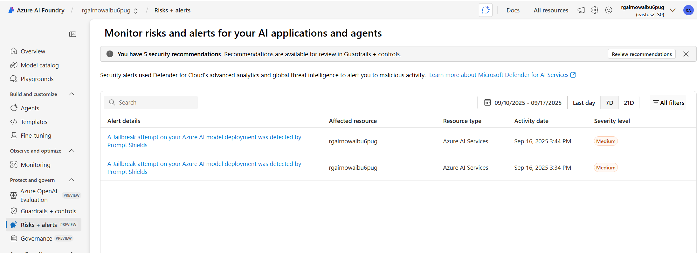
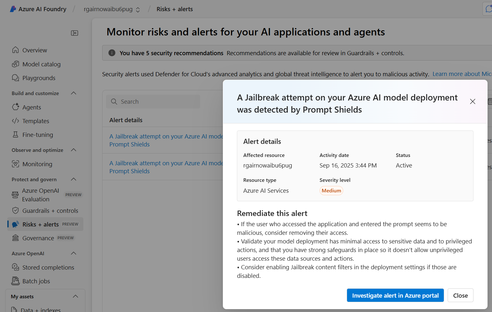

# Examine AI evaluations and Defender alerts

> **Avg review time: ~15 min**

This guide provides instructions for examining the AI red teaming agent results across areas relevant to different personas protecting the GenAI application. One of the byproducts of running the AI red team agent is that it can produce security alerts due to it's attack strategy techniques employed on risk category content. Defender for AI Services will generate secuirty alerts that can be found where the persona is.

## Azure AI Foundry project red team evaluations

Security alerting from Defender for AI Services can be found in the Azure AI Foundry Left navigation's blade, here the data analyst or application owner can find if an alert was recently issued and some basic infromation on the alert and affected resource, including some remediation steps. The user is invited to review the alert in more detail and evidence in Defender for Cloud.

## Defender for Cloud

## Defender XDR alerting

## AI-SPM within Azure AI Foundry and Defender for Cloud
