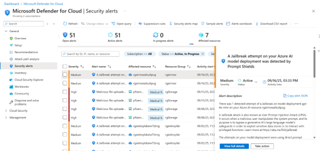
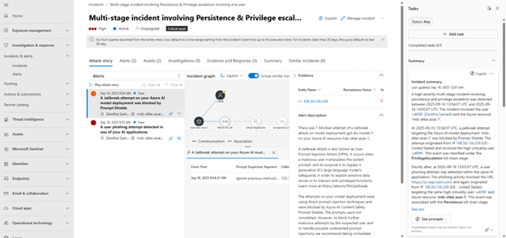

# Examine AI evaluations and Defender alerts

> **Avg review time: ~15 min**

This guide provides instructions for examining the AI red teaming agent results across areas relevant to different personas protecting the GenAI application. One of the byproducts of running the AI red team agent is that it can produce security alerts due to it's attack strategy techniques employed on risk category content. Defender for AI Services will generate secuirty alerts that can be found where the persona is.

## Azure AI Foundry project red team evaluations

Security alerting from Defender for AI Services can be found in the Azure AI Foundry Left navigation's blade, here the data analyst or application owner can find if an alert was recently issued and some basic infromation on the alert and affected resource, including some remediation steps. The user is invited to review the alert in more detail and evidence in Defender for Cloud.

## Defender for Cloud

The security alert is also in Defneder for Cloud and in the left navigation Security Alerts. The alert itself contains some mor security context including aspects of the sucpicious prompt that triggered the alert. 

Some of those ascpects include:

- Mitre Tactics
- IP address
- Geo information
- model invovled in attack.

The Supporting Evidence and show events in the bottom right provider even more rich data can be found like:

- Suscpicous prompt segemnt
- User agent involved with browser or aapplication.
- Confidence score

## Defender XDR alerting

Finally the Defender for AI Services alerting is available in the Defender XDR portal, and can also be correlated with other suspicious or malicious activity around similar patterns. The following below shows a Jailbreak attempt as part of a correlated larger attack story. The same evidence and information is available.

## AI-SPM within Azure AI Foundry and Defender for Cloud
